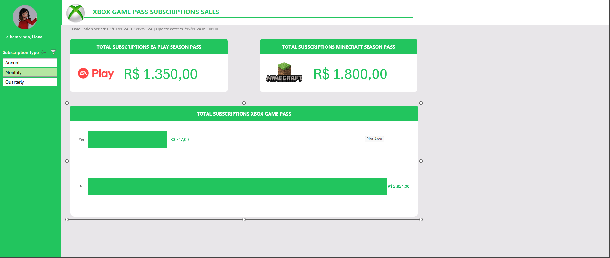

# 📊 Dashboard de Vendas no Excel

Projeto desenvolvido como desafio prático com foco em análise de dados e visualização de informações utilizando Microsoft Excel.

---

# 📸 Preview do Dashboard



---

# 🎯 Objetivo do Projeto

Transformar dados brutos em informações visuais claras e organizadas, permitindo:

- Melhor análise de desempenho de vendas
- Acompanhamento de métricas importantes
- Visualização dinâmica dos dados
- Apoio à tomada de decisões

---

# 📌 Indicadores Apresentados

O dashboard apresenta informações como:

- 💰 Receita Total
- 📦 Total de Assinaturas
- 🎮 Assinaturas EA Play
- ⛏️ Assinaturas Minecraft Season Pass
- 📈 Comparativos de vendas
- 📊 Gráficos dinâmicos
- 🎛️ Segmentações e filtros interativos

---

# 🛠️ Ferramentas Utilizadas

- Microsoft Excel
- Tabelas Dinâmicas
- Segmentação de Dados
- Fórmulas Excel
- GitHub

---

# 📂 Base de Dados

A base de dados utilizada para construção do dashboard está disponível abaixo:

[📊 Download da Base de Dados](base.xlsx)

---

# 📥 Download do Dashboard

[📁 Baixar Dashboard](dashboard_vendas.xlsx)

---

# 📂 Estrutura do Projeto

```bash
dashboard_vendas_dio/
│
├── README.md
├── base.xlsx
├── dashboard_vendas.xlsx
└── dashboard.png
```

---

# 🚀 Como Utilizar

1. Faça o download do arquivo `.xlsx`
2. Abra no Microsoft Excel
3. Utilize os filtros interativos
4. Navegue pelos indicadores e gráficos

---

# 📚 Aprendizados

Durante o desenvolvimento deste projeto foram praticados conceitos como:

- Organização de dados
- Criação de dashboards
- Visualização de informações
- Design de dashboards
- Manipulação de tabelas dinâmicas
- Uso de gráficos no Excel

---

# ✅ Status do Projeto

✔️ Projeto Finalizado
